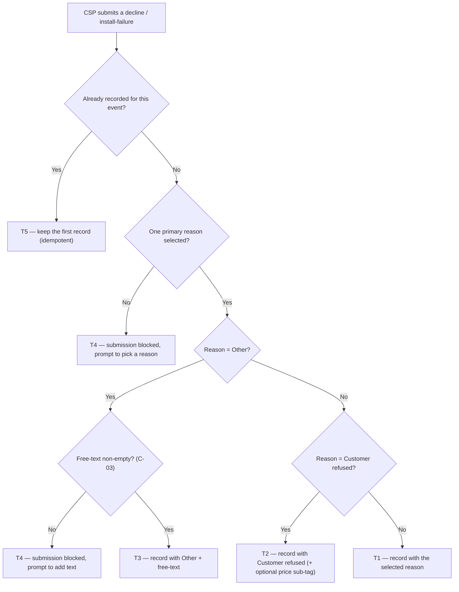

# Decline & Install-Failure Reason Set — the CSP's stated reason, captured clean

| | | | |
|---|---|---|---|
| **Owner** — Ashish Raj (PM) | **Reviewer** — TBD ⚠️ *AI GENERATED — review* | **Status** — Draft | **Sign-off** — Pending |
| **Version** — v0.1 · 11 Aug 2026 | **Consulted — CSP App** — TBD ⚠️ *AI GENERATED — review* | **Consulted — Data/Analytics** — TBD ⚠️ *AI GENERATED — review* | **Consulted — Serviceability (Genie)** — TBD ⚠️ *AI GENERATED — review* |

---

## 1. Objective & Definition of Success

**Objective.** Every time a CSP won't install a booking, we capture *why* in a form we can trust — a single, unbiased, complete reason — so the system can later stop sending that customer to a CSP who won't serve them ⚠️ *AI GENERATED — review* (the routing action itself is downstream and out of scope here).

**Boundary.** This spec governs the **reason picker** — the list shown, the selection, and what is stored — at the two moments a CSP declines to install: a **decline** (before he accepts the booking) and an **install-failure report** (after acceptance, on site). It leaves unchanged: routing / DAS, the nearby-connections assist popup (Part 2), the verification layer (Part 3), Genie serviceability, and the future Availability service action for "technician not available" — all separate specs (AC-REG-1). Reasons already recorded on past events are never altered (AC-REG-2 ⚠️ *AI GENERATED — review*). Exactly one primary reason is recorded per event (C-04), with an optional price sub-tag and an "Other" free-text.

### Guardrails — promises that hold on every path

| ID | Guardrail | One line | Anchors |
|---|---|---|---|
| G1 | **No reason, no record** | Every decline and install-failure is recorded with exactly one valid reason (or "Other" plus non-empty text). | R1b · R3b · AC-REC-1 · AC-BLK-1 · MQ-2 |
| G2 | **No position bias** | Reason order is randomised so no reason gains selection share from where it sits; "Other" is always last. | R1c · AC-GRD-1 · MQ-1 |
| G3 | **One taxonomy, both sides** | Decline and install-failure always draw from one identical reason list. | R4 · AC-GRD-2 · MQ-6 |
| G4 | **No signal lost on club** | Clubbing "not interested" and "price" into "Customer refused" preserves the price case as a sub-tag. | R2 · AC-REC-2 · MQ-4 |

### Success metrics

| ID | Metric | Baseline | Target | Source |
|---|---|---|---|---|
| M1 | Selection share of a reason no longer varies with its display position (position bias removed) | n/a — new capability (order was fixed) | No detectable position effect ⚠️ *AI GENERATED — review* | MQ-1 |
| M2 | Declines / install-failures recorded with exactly one valid reason | ~100% *(today's list is mandatory single-select)* ⚠️ *AI GENERATED — review* | 100% | MQ-2 |
| M3 | Volume of "Other" selections and recurring free-text themes surfaced for taxonomy review | n/a — new capability | Reviewable monthly ⚠️ *AI GENERATED — review* | MQ-3 |

**Invariant (not a metric):** G1 reason-less decline/failure = 0, zero tolerance. Monitored via MQ-2, not trended.

---

## 2. User Stories & Rules

| ID | Story | MUST | MUST NOT |
|---|---|---|---|
| R1 | As a CSP who won't install a booking, I see a clear list of reasons and pick the one that fits, so I can tell Wiom why in one tap. | **(a)** Show the current configured reason list (C-01) at both capture points. **(b)** Require exactly one primary reason (C-04) before the decline / install-failure is accepted. **(c)** Randomise the order per task (C-02) with "Other" pinned last. | Record a decline / install-failure with no reason, or with more than one primary reason. |
| R2 | As Wiom, when the CSP says the customer refused, I still want to know if it was about price. | **(a)** Offer an optional "price" sub-tag under "Customer refused". **(b)** Record the sub-tag when chosen. | **(a)** Force the sub-tag — it is optional. **(b)** Lose the price distinction that existed before "not interested" and "price" were clubbed. |
| R3 | As a CSP whose reason isn't in the list, I pick "Other" and type it, so a missing reason still gets captured. | **(a)** Offer "Other", always last. **(b)** Require non-empty free-text (C-03) when "Other" is chosen. **(c)** Store the free-text for later taxonomy review ⚠️ *AI GENERATED — review*. | **(a)** Accept "Other" with empty text. **(b)** Show the free-text back to the CSP as anything but his own input. |
| R4 | As Wiom, I want the decline and install-failure lists to stay identical so the two moments can be read together. | Serve one identical configured list (C-01) at both capture points. | Let the two lists diverge. |
| R5 | As the taxonomy owner, I want to change the reason list without shipping a new app build, so the list can evolve as "Other" surfaces new reasons. | **(a)** Keep the reason list — items, active/retired, order-eligibility — config-driven (C-01). **(b)** A reason retired in config stops appearing on new sheets from that change forward. | **(a)** Alter reasons already recorded on past events. **(b)** Show a retired reason on a newly opened sheet. |
| R6 | As a CSP with no technician available, I can pick "Technician not available (ladka nahi hai)", so that supply gap is captured. | Capture it like any other reason. | Trigger any availability / pause-installs action in V1 — the Availability-service handoff is out of scope here ⚠️ *AI GENERATED — review*. |
| R7 | As Data, I want removed and clubbed reasons to map to their new home, so historical trend lines stay comparable. | Maintain a mapping: old "Network setup not possible" → the coverage reason "Service not available"; old "Customer not interested" and "Customer did not agree with the plan price" → "Customer refused" (price → the price sub-tag) ⚠️ *AI GENERATED — review*. | Break trend continuity by dropping the old reasons with no mapping. |

---

## 3. System Behaviour

### 3a. System flow chart

**Precedence:** the reason list is read when the sheet is **rendered**; a reason valid at render stays valid for that submission even if config retires it before the CSP taps submit (AC-RACE-1 ⚠️ *AI GENERATED — review*).

### 3b. State transition table — canon

Lifecycle of a **reason-capture** (created when a CSP submits a decline or an install-failure report; it attaches the stated reason to that event). The decline / install-failure state machine itself — the ES candidate's `DECLINED` and `INSTALLATION_REPORTED_FAILED` transitions — is out of scope; this spec governs only the reason attached to those events.

| ID | From | Action / Trigger | Rule / Check | To | Side-effects |
|---|---|---|---|---|---|
| T1 | — | Submit with a listed reason (not Other, not Customer refused) | Exactly one primary reason selected (R1b) | Recorded | Reason-capture stored: reason + capture point (decline / install-failure); the display order used is logged (MQ-1). |
| T2 | — | Submit with "Customer refused" | One primary reason selected (R1b) | Recorded | Stored as "Customer refused" with the optional price sub-tag if chosen (R2). |
| T3 | — | Submit with "Other" | Free-text non-empty (R3b, C-03) | Recorded | Stored as "Other" + the free-text; text queued for taxonomy review (R3c) ⚠️ *AI GENERATED — review*. |
| T4 | Sheet shown | Submit | No primary reason selected, **or** "Other" with empty text | Sheet shown | Submission blocked; CSP prompted to pick a reason / add text (R1b, R3b). Nothing is recorded. |
| T5 | Recorded | Duplicate submit for the same event (double-tap) | Event already recorded | Recorded | No second reason-capture is created — the first stands (idempotent) ⚠️ *AI GENERATED — review*. |

---

## 4. Screen Requirements

**Experience intent:** the CSP tells us why in one honest tap — the list is short, neutral, and never nudges him toward one answer. ⚠️ *AI GENERATED — review*

**Master design file:** TBD — the exact Step-1 UX is finalised by the Solutions team. ⚠️ *AI GENERATED — review*

### Reason sheet (CSP app) — decline & install-failure — design TBD

**States:** default (list shown, none selected) · reason selected · "Other" selected (free-text field shown) · "Customer refused" selected (price sub-tag shown) · submit blocked (no reason, or Other with empty text)
**Freshness:** the list reflects the current config (C-01) on open.

| Element | Source / Routes to | Logic |
|---|---|---|
| Field — reason list | config (C-01); order per C-02 | randomised per task, "Other" always last (R1c, G2) |
| Action — select one reason | — | single-select; max one primary reason (C-04) |
| Field — price sub-tag | config (C-01) | shown only when "Customer refused" is selected; optional (R2a) |
| Check — "Other" free-text | — | required non-empty (C-03) when "Other" selected; else submit blocked (R3b, T4) |
| Action — submit | T1 / T2 / T3 via §3a | precondition: one primary reason, plus non-empty text if "Other" |

### Reason-config console (internal) — design TBD ⚠️ *AI GENERATED — review*

**States:** list of reasons (active / retired) · edit
**Freshness:** changes take effect on the next sheet render (R5b)

| Element | Source / Routes to | Logic |
|---|---|---|
| Field — reason list | config (C-01) | shows active and retired reasons |
| Action — add / retire / reorder-eligibility | — | edits C-01; no app release (R5a); does not alter past records (R5 MUST NOT) |

---

## 5. Configurability

| ID | Parameter | Default | Range | Who changes it |
|---|---|---|---|---|
| C-01 | Reason list — items, active/retired, order-eligibility, price sub-tag (governs the sheet, R1a/R4/R5) | V1 list: Service not available at this location · Required device is currently unavailable · Customer refused (+ optional price sub-tag) · Installation could not be scheduled · Could not understand the address · Technician not available (ladka nahi hai) · Other | Editable via config (add / remove / reorder-eligibility) | Product |
| C-02 | Reason-order randomisation scope (R1c) | Per task; "Other" pinned last | {per task, off} ⚠️ *AI GENERATED — review* | Product |
| C-03 | "Other" free-text minimum (R3b) | Non-empty (≥ 1 character) ⚠️ *AI GENERATED — review* | Fixed in V1 ⚠️ *AI GENERATED — review* | Product |
| C-04 | Max primary reasons per event (R1b) | 1 | Fixed in V1 | Product |

---

## 6. Measurement

| ID | The system must be able to answer… | Feeds |
|---|---|---|
| MQ-1 | Does the selection share of each reason depend on its display position? | M1 · G2 |
| MQ-2 | What share of declines / install-failures were recorded with exactly one valid reason (and "Other" with non-empty text)? | M2 · G1 invariant |
| MQ-3 | How many "Other" selections were made, and what recurring themes appear in the free-text? | M3 (taxonomy evolution) |
| MQ-4 | Of "Customer refused" selections, what share carried the price sub-tag? | R2 · G4 |
| MQ-5 | What is the reason distribution across both capture points after the change, mapped to the pre-change trend? | R7 (continuity) ⚠️ *AI GENERATED — review* |
| MQ-6 | Do the decline sheet and the install-failure sheet serve the identical reason set in production? | G3 · R4 |

---

## 7. Acceptance Criteria

### REC — Reason recorded (T1, T2, T3)

| AC | Given / When / Then | Verifies | Status |
|---|---|---|---|
| AC-REC-1 | **Given** a CSP declining a booking in zone_3289, with the sheet showing 6 reasons + "Other", **When** he selects "Service not available at this location" and submits, **Then** the decline is recorded with that one reason, capture point = decline, and the display order shown is logged. | R1a · R1b · T1 · G1 | Settled |
| AC-REC-2 | **Given** a CSP filing an install-failure on site, **When** he selects "Customer refused", taps the "price" sub-tag, and submits, **Then** the failure is recorded with reason "Customer refused" and sub-tag "price". | R2a · R2b · T2 · G4 | Settled |
| AC-REC-3 | **Given** "Customer refused" is selected and the price sub-tag is *not* tapped, **When** he submits, **Then** it is recorded as "Customer refused" with no sub-tag. | R2a (optional) · T2 | Settled |
| AC-REC-4 | **Given** the CSP selects "Other", **When** he types "gali me ladai ho rahi thi, ja nahi paya" and submits, **Then** it is recorded with reason "Other" and that free-text, and the text is queued for taxonomy review. | R3a · R3b · R3c · T3 | Settled ⚠️ *AI GENERATED — review* |
| AC-REC-5 | **Given** the CSP selects "Technician not available (ladka nahi hai)", **When** he submits, **Then** it is recorded as that reason and **no** availability / pause-installs action fires. | R6 · T1 | Settled ⚠️ *AI GENERATED — review* |

### BLK — Submission blocked (T4)

| AC | Given / When / Then | Verifies | Status |
|---|---|---|---|
| AC-BLK-1 | **Given** the reason sheet with no reason selected, **When** the CSP taps submit, **Then** submission is blocked, he is prompted to pick a reason, and no reason-capture is recorded. | R1b · T4 · G1 | Settled |
| AC-BLK-2 | **Given** "Other" is selected with an empty text field, **When** he taps submit, **Then** submission is blocked, he is prompted to add text, and nothing is recorded. | R3b · T4 · C-03 | Settled |

### WF — Workflows (open → select → record)

| AC | Given / When / Then | Verifies | Status |
|---|---|---|---|
| AC-WF-1 | **Given** a CSP declining a booking, with the reason sheet loaded from config C-01, **When** he is shown the per-task randomised list ("Other" last), selects "Service not available at this location", and submits, **Then** the decline is recorded with that one reason, the display order used is logged, and downstream routing runs exactly as before. | R1a · R1b · R1c · T1 · G1 · G2 · §1 Boundary | Settled |

### GRD — Guardrails

| AC | Given / When / Then | Verifies | Status |
|---|---|---|---|
| AC-GRD-1 | **Given** task A's reason sheet, **When** the CSP opens it twice within task A, **Then** the order is identical both times (per-task stable, C-02); across a different task B the order may differ; and "Other" is last in every render. | R1c · G2 · C-02 | Settled |
| AC-GRD-2 | **Given** one config (C-01), **When** the sheet renders at a decline and at an install-failure, **Then** both show the identical set of reasons in the same membership. | R4 · G3 | Settled |

### CFG — Configurability (C-01)

| AC | Given / When / Then | Verifies | Status |
|---|---|---|---|
| AC-CFG-1 | **Given** Product retires "Could not understand the address" in config, **When** a CSP opens a new reason sheet, **Then** that reason no longer appears — with no app release — and events that already recorded it are unchanged. | R5a · R5b · R5(MUST NOT) | Settled |
| AC-CFG-2 | **Given** Product adds a new reason in config, **When** the sheet next renders, **Then** the new reason appears in the randomised list (before "Other"). | R5a · C-01 | Settled ⚠️ *AI GENERATED — review* |

### RACE — Races

| AC | Given / When / Then | Verifies | Status |
|---|---|---|---|
| AC-RACE-1 | **Given** a CSP opened the sheet while "Could not understand the address" was active, **When** config retires it before he taps submit and he had selected it, **Then** the submission still records that reason (valid at render), and the next sheet render omits it. | §3a precedence | Settled ⚠️ *AI GENERATED — review* |

### DUP — Duplicate trigger (T5)

| AC | Given / When / Then | Verifies | Status |
|---|---|---|---|
| AC-DUP-1 | **Given** a decline already recorded with "Service not available", **When** the CSP double-taps submit, **Then** exactly one reason-capture exists for that event. | T5 | Settled ⚠️ *AI GENERATED — review* |

### BV — Boundary values ("Other" text length, C-03)

| AC | Given / When / Then | Verifies | Status |
|---|---|---|---|
| AC-BV-1 | **Given** "Other" selected, **When** the text field has 0 characters, **Then** submit is blocked (C-03 floor). | C-03 · R3b | Settled |
| AC-BV-2 | **Given** "Other" selected, **When** the text field has 1 character, **Then** submit is allowed and the reason-capture stores that text. | C-03 · R3b | Settled ⚠️ *AI GENERATED — review* |

### REG — Regression (§1 Boundary)

| AC | Given / When / Then | Verifies | Status |
|---|---|---|---|
| AC-REG-1 | **Given** a decline recorded through the new reason set, **When** downstream routing / DAS runs, **Then** routing behaviour is exactly as it is today — this spec changes only what reason is captured, not what happens next. | §1 Boundary | Settled |
| AC-REG-2 | **Given** declines recorded before this change (e.g. old "Network setup not possible"), **When** the new list ships, **Then** those historical records are unchanged and remain mapped to their new home for trend continuity (R7). | §1 Boundary · R7 | Settled ⚠️ *AI GENERATED — review* |

---

## 8. Glossary

| Term | Meaning | Owner (domain) |
|---|---|---|
| Reason-capture | **Canonical definition:** the record attaching one stated reason (plus optional price sub-tag or "Other" free-text, and the capture point) to a decline or install-failure event. All other mentions cite this. | Data |
| Capture point | Which of the two moments the reason was given: **decline** (before the CSP accepts the booking) or **install-failure report** (after acceptance, on site). Both use the same list (R4). | — |
| Customer refused | **Canonical definition:** the single customer-intent reason formed by clubbing the old "Customer is not interested" and "Customer did not agree with the plan price". Carries an optional **price** sub-tag so the price case is not lost (R2, G4). | — |
| Other | The catch-all reason, always shown last, requiring non-empty free-text (R3). Its text is the raw input for evolving the list (M3). | — |
| Reason list | **Canonical definition:** the config-driven set of reasons (items, active/retired, order-eligibility, price sub-tag) served to the sheet; changeable without an app release (C-01, R5). | Product |
| Position bias | The tendency to pick a reason because of where it sits in the list, not because it is true — the effect randomisation (G2, C-02) removes. | — |
| Technician not available (ladka nahi hai) | A reason for "no technician / labour to send". Captured only in V1; its Availability-service handoff (pause installs for the day) is out of scope here. | Product |

---

## 9. Notes for System Capabilities

What the platform must be able to do for this feature to exist. Whether these are one system or several, and how they interact, is the implementer's design.

| Capability | Needed by |
|---|---|
| Serve a config-driven reason list at both capture points, randomised per task with "Other" last. | R1 · R4 · C-01 · C-02 · G2 · G3 |
| Require and store exactly one primary reason per event, plus an optional price sub-tag and "Other" free-text. | R1b · R2 · R3 · C-04 · G1 |
| Change the reason list — add / remove / reorder-eligibility — without an app release, effective on next render, without touching past records. | R5 · C-01 |
| Log the display order used per event, to test that selection share is position-independent. | M1 · MQ-1 · G2 |
| Preserve historical reasons and map removed / clubbed reasons to their new home for trend continuity. | R7 · MQ-5 |
| Queue "Other" free-text for taxonomy review. | R3c · M3 · MQ-3 |

---

## AI-generated content for review

| Location | What was generated | Basis |
|---|---|---|
| Header | Reviewer + all three Consulted names = TBD | No names supplied; PRD needs an Eng reviewer and consulted domains named before sign-off. |
| §1 Objective | The customer-outcome tail ("stop sending that customer to a CSP who won't serve them") | Part 1 is capture-only; the direct customer outcome is downstream. Inferred from the initiative's purpose to satisfy the "customer outcome" rule. |
| §1 M1 target | "No detectable position effect" | PM asked to remove position bias; the pass/fail bar for M1 is inferred, not stated. |
| §1 M2 baseline | "~100% today" | Inferred: today's list is mandatory single-select. Confirm the current capture is truly reason-mandatory. |
| §1 M3 target | "Reviewable monthly" | Cadence for taxonomy review not stated. |
| §2 R3c | Store "Other" free-text for taxonomy review | Storing/mining free-text is implied by the self-learning intent but not stated for Part 1. Confirm it is in scope here vs Part 3. |
| §2 R6 | "No availability action in V1" | From the brief (handoff out of scope); the explicit V1 "capture only, no action" behaviour is inferred. |
| §2 R7 + MQ-5 + AC-REG-2 | Historical mapping / trend continuity for removed & clubbed reasons | Not raised by the PM; added so the change doesn't break reporting. Confirm it is wanted and confirm the exact old→new mapping. |
| §3b T5 + AC-DUP-1 | Duplicate-submit is idempotent (one reason-capture) | Standard safeguard; duplicate-trigger behaviour not specified. |
| §3a precedence + AC-RACE-1 | Reason validity is fixed at render | A rule was needed for config changing mid-session; the chosen resolution is inferred. |
| §4 | Design links = TBD (Solutions team); Reason-config console screen; experience-intent line | UX not yet designed; the internal config console is inferred from the config-driven decision. |
| §5 C-02 | Range "{per task, off}" | PM chose "per task"; the allowed range is inferred. |
| §5 C-03 | "Other" minimum = non-empty (≥1 char), Fixed in V1 | Min-length rule not specified; non-empty is the minimal safe default. |
| §7 AC-REC-4/5, AC-CFG-2, AC-RACE-1, AC-DUP-1, AC-BV-2, AC-REG-2 | Marked ACs | Each rests on an inferred rule/behaviour above; they test decisions the PM has not yet confirmed. |
