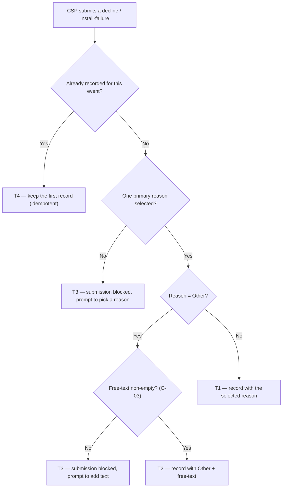

# Decline & Install-Failure Reason Set — the CSP's stated reason, captured clean

| | | | |
|---|---|---|---|
| **Owner** — Ashish Raj (PM) | **Reviewer** — TBD ⚠️ *AI GENERATED — review* | **Status** — Draft | **Sign-off** — Pending |
| **Version** — v0.4 · 11 Aug 2026 | **Consulted — CSP App** — TBD ⚠️ *AI GENERATED — review* | **Consulted — Data/Analytics** — TBD ⚠️ *AI GENERATED — review* | **Consulted — DAS / Quality** — TBD ⚠️ *AI GENERATED — review* |

---

## 1. Objective & Definition of Success

**Objective.** A CSP who won't install a booking picks the real reason from a list built for his situation — complete enough to fit his case, and unbiased in its order — so he chooses *consciously* instead of guessing, and the reason we capture is the true one.

**Boundary.** This spec governs the **reason picker** — the list shown, the selection, and what is stored — at the two moments a CSP declines to install: a **decline** (before he accepts the booking) and an **install-failure report** (after acceptance, on site).

**The reason set (V1).** The CSP-facing copy below (English and Hindi), served identically at both capture points (R4). **The copy is part of this spec** — Product owns it, and it is editable via config (C-01). Sheet header: *"Why can't you take this job? — Telling us the right reason helps us send you better work."*

| Reason (CSP sees) | Hindi | What it means |
|---|---|---|
| The cable can't reach this place | इस जगह तार नहीं जा पाता | not serviceable / coverage |
| I couldn't understand the address | पता समझ नहीं आया | address unclear |
| The customer said no | कस्टमर ने मना कर दिया | customer declined |
| I don't have a device right now | नेटबॉक्स अभी उपलब्ध नहीं है | device / netbox unavailable |
| No one free to install it | लगाने वाला कोई नहीं है | technician / labour unavailable |
| Another reason *(free text, always last)* | कोई और वजह | anything else — the CSP types it |

**How the set changes (add-only).** The underlying reason list only **grows** — no reason is ever removed from the system. We **add** three reasons — *"I couldn't understand the address"*, *"No one free to install it"*, and the free-text *"Another reason"* — and **reword** the copy of the kept ones. The picker then **shows only the six above** (C-01); any previously-shown reason not in this list stays in the system, just no longer shown to the CSP. Any new reason must also be recognised by the downstream services that read reasons, so they consume it as expected (G5).

### Guardrails — promises that hold on every path

| ID | Guardrail | One line | Anchors |
|---|---|---|---|
| G1 | **No reason, no record** | Every decline and install-failure is recorded with exactly one valid reason (or "Other" plus non-empty text). | R1b · R3b · AC-REC-1 · AC-BLK-1 · MQ-2 |
| G2 | **No position bias** | Reason order is randomised so no reason gains selection share from where it sits; "Other" is always last. | R1c · AC-GRD-1 · MQ-1 |
| G3 | **One taxonomy, both sides** | Decline and install-failure always draw from one identical reason set. | R4 · AC-GRD-2 · MQ-4 |
| G4 | **No downstream impact** | Changing or reading the reason set never breaks or alters the behaviour of DAS, Quality, or any service that consumes these reasons. | R2 · AC-REG-1 · MQ-3 |
| G5 | **Decline / failure works end-to-end** | Once a CSP marks a decline or install-failure, the submission completes and DAS, CL OS and every downstream service receive it and behave as expected. | R1 · R2 · AC-REG-2 · MQ-6 |
| G6 | **Every decline is understandable downstream** | Each logged decline / install-failure carries a stable reason identifier that analytics, product, Genie, DAS, CL and any downstream team can map to exactly why the CSP declined. | R8 · AC-REC-1 · MQ-7 |

### Success metrics

| ID | Metric | Baseline | Target | Source |
|---|---|---|---|---|
| M1 | Selection share of a reason no longer varies with its display position (position bias removed) | n/a — new capability (order was fixed) | No detectable position effect ⚠️ *AI GENERATED — review* | MQ-1 |
| M2 | Declines / install-failures recorded with exactly one valid reason | ~100% *(today's list is mandatory single-select)* ⚠️ *AI GENERATED — review* | 100% | MQ-2 |

**Invariant (not a metric):** G1 reason-less decline/failure = 0, zero tolerance. Monitored via MQ-2, not trended.

---

## 2. User Stories & Rules

| ID | Story | MUST | MUST NOT |
|---|---|---|---|
| R1 | As a CSP who won't install a booking, I see a clear list of reasons and pick the one that fits, so I can tell Wiom why in one tap. | **(a)** Show the current configured reason set (C-01) at both capture points. **(b)** Require exactly one primary reason (C-04) before the decline / install-failure is accepted. **(c)** Randomise the order per task (C-02) with "Other" pinned last. | Record a decline / install-failure with no reason, or with more than one primary reason. |
| R2 | As Wiom, I want changing the reason set to be safe for every consumer, so DAS, Quality and any service reading these reasons keep working. | Keep the reason contract stable and backward-compatible for consumers — a removed reason simply stops being produced; an added reason is a new value a consumer may ignore. | Break or change the behaviour of any downstream service (DAS, Quality, any reader) by editing the reason set. |
| R3 | As a CSP whose reason isn't in the list, I pick "Other" and type it, so a missing reason still gets captured. | **(a)** Offer "Other", always last. **(b)** Require non-empty free-text (C-03) when "Other" is chosen. **(c)** Store the free-text. | **(a)** Accept "Other" with empty text. **(b)** Show the free-text back to the CSP as anything but his own input. |
| R4 | As Wiom, I want the decline and install-failure lists to stay identical so the two moments can be read together. | Serve one identical configured reason set (C-01) at both capture points. | Let the two lists diverge. |
| R5 | As the taxonomy owner, I want to change which reasons are shown — and any reason's copy — without shipping a new app build, so the list can evolve. | **(a)** Keep the shown-reason set — which reasons appear, each reason's display copy, order-eligibility — config-driven (C-01), applied identically at both capture points. **(b)** A reason hidden in config stops appearing on new sheets from that change forward. **(c)** The reason list is add-only — reasons may be added; none is ever removed. | **(a)** Remove an existing reason from the underlying list. **(b)** Alter reasons already recorded on past events. **(c)** Show a hidden reason on a newly opened sheet. |
| R6 | As a CSP with no one free to install, I can pick "No one free to install it", so that supply gap is captured. | Capture it like any other reason. | Trigger any availability / pause-installs action in V1 — the Availability-service handoff is out of scope here ⚠️ *AI GENERATED — review*. |
| R7 | As Wiom, I want to know exactly what the CSP saw when he chose, so his choice is auditable and position effects are measurable. | Record, per event, the **exact set of reasons shown and their order**, retrievable later. | Record only the chosen reason with no trace of what was shown. |
| R8 | As analytics / product / Genie / DAS / CL and any downstream team, I want every logged decline / install-failure to carry a stable reason identifier, so I can tell exactly *why* the CSP declined. | **(a)** Record each reason as a **stable identifier** (its values defined by tech) that stays the same even when the display copy changes. **(b)** Map each identifier one-to-one to a single, well-defined "why". | **(a)** Use the (changeable) display copy as the downstream signal. **(b)** Log a reason no downstream team can interpret. |

---

## 3. System Behaviour

### 3a. System flow chart

**Precedence:** the reason set is read when the sheet is **rendered**; a reason valid at render stays valid for that submission even if config hides it before the CSP taps submit (AC-RACE-1 ⚠️ *AI GENERATED — review*).

### 3b. State transition table — canon

Lifecycle of a **reason-capture** (created when a CSP submits a decline or an install-failure report; it attaches the stated reason to that event). The decline / install-failure state machine itself — the ES candidate's `DECLINED` and `INSTALLATION_REPORTED_FAILED` transitions — is out of scope; this spec governs only the reason attached to those events.

| ID | From | Action / Trigger | Rule / Check | To | Side-effects |
|---|---|---|---|---|---|
| T1 | — | Submit with a listed reason (not "Other") | Exactly one primary reason selected (R1b) | Recorded | Reason-capture stored: reason + capture point (decline / install-failure); the exact set of reasons shown and their order is recorded (R7, MQ-1, MQ-5). |
| T2 | — | Submit with "Other" | Free-text non-empty (R3b, C-03) | Recorded | Stored as "Other" + the free-text (R3c); reasons shown + order recorded (R7). |
| T3 | Sheet shown | Submit | No primary reason selected, **or** "Other" with empty text | Sheet shown | Submission blocked; CSP prompted to pick a reason / add text (R1b, R3b). Nothing is recorded. |
| T4 | Recorded | Duplicate submit for the same event (double-tap) | Event already recorded | Recorded | No second reason-capture is created — the first stands (idempotent) ⚠️ *AI GENERATED — review*. |

---

## 4. Screen Requirements

**Experience intent:** the CSP tells us why in one honest tap — the list is short, neutral, and never nudges him toward one answer. ⚠️ *AI GENERATED — review*

**Master design file:** reason sheet designed — V1 mockups approved (English + Hindi); Figma link TBD. ⚠️ *AI GENERATED — review*

### Reason sheet (CSP app) — decline & install-failure

**Header (spec-owned copy, §1):** title *"Why can't you take this job?"*, subtitle *"Telling us the right reason helps us send you better work."*
**States:** default (list shown, none selected) · reason selected · "Another reason" selected (inline text box shown) · submit blocked (no reason, or "Another reason" with empty text)
**Freshness:** the list reflects the current config (C-01) on open.

| Element | Source / Routes to | Logic |
|---|---|---|
| Field — reason list | config (C-01); order per C-02 | single-select radio list; randomised per task, "Another reason" always last (R1c, G2) |
| Action — select one reason | — | single-select; max one primary reason (C-04) |
| Field — "Another reason" text box | — | appears inline directly under "Another reason" when it is selected (R3) |
| Check — free-text | — | required non-empty (C-03) when "Another reason" selected; else submit blocked (R3b, T3) |
| Action — submit | T1 / T2 via §3a | precondition: one primary reason, plus non-empty text if "Another reason" |

### Reason-config console (internal) — design TBD ⚠️ *AI GENERATED — review*

**States:** list of reasons (shown / hidden) · edit
**Freshness:** changes take effect on the next sheet render (R5b)

| Element | Source / Routes to | Logic |
|---|---|---|
| Field — reason set | config (C-01) | shows all reasons — shown and hidden — and their copy |
| Action — add / show / hide / reorder-eligibility / edit copy | — | edits C-01; no app release (R5a); does not alter past records (R5 MUST NOT) |

---

## 5. Configurability

| ID | Parameter | Default | Range | Who changes it |
|---|---|---|---|---|
| C-01 | Shown-reason set — which reasons appear, **each reason's display copy**, order-eligibility; applied identically to decline and install-failure (governs the sheet, R1a/R4/R5) | The V1 six in §1 | Editable via config — show / hide a reason, reorder-eligibility, **change any reason's copy** — with no app release, effective at both capture points; the underlying list is add-only (reasons added, never removed) | Product |
| C-02 | Reason-order randomisation scope (R1c) | Per task; "Other" pinned last | {per task, off} ⚠️ *AI GENERATED — review* | Product |
| C-03 | "Other" free-text minimum (R3b) | Non-empty (≥ 1 character) ⚠️ *AI GENERATED — review* | Fixed in V1 ⚠️ *AI GENERATED — review* | Product |
| C-04 | Max primary reasons per event (R1b) | 1 | Fixed in V1 | Product |

---

## 6. Measurement

| ID | The system must be able to answer… | Feeds |
|---|---|---|
| MQ-1 | Does the selection share of each reason depend on its display position? | M1 · G2 |
| MQ-2 | What share of declines / install-failures were recorded with exactly one valid reason (and "Other" with non-empty text)? | M2 · G1 invariant |
| MQ-3 | When the reason set changes (a reason removed, added, or its copy edited), does any downstream consumer — DAS, Quality, any reader — error or change behaviour? | G4 |
| MQ-4 | Do the decline sheet and the install-failure sheet serve the identical reason set in production? | G3 · R4 |
| MQ-5 | For any given decline / install-failure, which reasons were shown to the CSP and in what order? | R7 · M1 |
| MQ-6 | Are all declines / install-failures — including those with newly-added reasons — accepted and processed downstream by DAS and CL OS as expected? | G5 |
| MQ-7 | For every logged decline / install-failure, can a downstream team map its reason identifier to a single, unambiguous "why"? | G6 · R8 |

---

## 7. Acceptance Criteria

### REC — Reason recorded, one per reason type (T1, T2)

| AC | Given / When / Then | Verifies | Status |
|---|---|---|---|
| AC-REC-1 | **Given** a CSP declining a booking, with the sheet showing the 5 reasons + "Another reason", **When** he selects **"The cable can't reach this place"** and submits, **Then** it is recorded with that reason's stable identifier, capture point = decline, and any downstream team (analytics, Genie, DAS, CL) reads it unambiguously as *not serviceable / coverage*. | R1 · R8 · T1 · G1 · G6 | Settled |
| AC-REC-2 | **Given** the reason sheet, **When** the CSP selects **"I couldn't understand the address"** and submits, **Then** it is recorded with that reason's stable identifier and reads downstream as *address unclear*. | R1 · R8 · T1 · G6 | Settled |
| AC-REC-3 | **Given** the reason sheet, **When** the CSP selects **"The customer said no"** and submits, **Then** it is recorded with that reason's stable identifier — a first-class reason, not merged into any other — and reads downstream as *customer declined*. | R1 · R8 · T1 · G6 | Settled |
| AC-REC-4 | **Given** the reason sheet, **When** the CSP selects **"I don't have a device right now"** and submits, **Then** it is recorded with that reason's stable identifier and reads downstream as *device unavailable*. | R1 · R8 · T1 · G6 | Settled |
| AC-REC-5 | **Given** the reason sheet, **When** the CSP selects **"No one free to install it"** and submits, **Then** it is recorded with that reason's stable identifier and reads downstream as *technician / labour unavailable* — and **no** availability / pause-installs action fires in V1. | R6 · R8 · T1 · G6 | Settled ⚠️ *AI GENERATED — review* |
| AC-REC-6 | **Given** the CSP selects **"Another reason"**, **When** the inline text box appears and he types "gali me ladai ho rahi thi, ja nahi paya" and submits, **Then** it is recorded with the "Another reason" identifier plus his free-text, and reads downstream as *other* with the typed detail. | R3 · R8 · T2 · G6 | Settled |
| AC-REC-7 | **Given** a decline sheet that showed, in order, "The cable can't reach this place · I couldn't understand the address · The customer said no · I don't have a device right now · No one free to install it · Another reason", **When** the CSP selects the 3rd item and submits, **Then** the recorded event carries that exact shown list and order alongside the chosen reason, retrievable later. | R7 · T1 · MQ-5 | Settled |

### BLK — Submission blocked (T3)

| AC | Given / When / Then | Verifies | Status |
|---|---|---|---|
| AC-BLK-1 | **Given** the reason sheet with no reason selected, **When** the CSP taps submit, **Then** submission is blocked, he is prompted to pick a reason, and no reason-capture is recorded. | R1b · T3 · G1 | Settled |
| AC-BLK-2 | **Given** "Other" is selected with an empty text field, **When** he taps submit, **Then** submission is blocked, he is prompted to add text, and nothing is recorded. | R3b · T3 · C-03 | Settled |

### WF — Workflows (open → select → record)

| AC | Given / When / Then | Verifies | Status |
|---|---|---|---|
| AC-WF-1 | **Given** a CSP declining a booking, with the reason sheet loaded from config C-01, **When** he is shown the per-task randomised list ("Another reason" last), selects "The cable can't reach this place", and submits, **Then** the decline is recorded with that one reason and the exact reasons shown and their order are recorded. | R1a · R1b · R1c · T1 · G1 · G2 · R7 | Settled |

### GRD — Guardrails

| AC | Given / When / Then | Verifies | Status |
|---|---|---|---|
| AC-GRD-1 | **Given** task A's reason sheet, **When** the CSP opens it twice within task A, **Then** the order is identical both times (per-task stable, C-02); across a different task B the order may differ; and "Other" is last in every render. | R1c · G2 · C-02 | Settled |
| AC-GRD-2 | **Given** one config (C-01), **When** the sheet renders at a decline and at an install-failure, **Then** both show the identical set of reasons in the same membership. | R4 · G3 | Settled |

### CFG — Configurability (C-01)

| AC | Given / When / Then | Verifies | Status |
|---|---|---|---|
| AC-CFG-1 | **Given** Product hides "I couldn't understand the address" from the picker in config, **When** a CSP opens a new reason sheet, **Then** that reason no longer appears — with no app release — the reason still exists in the underlying list, and events that already recorded it are unchanged. | R5a · R5b · R5(MUST NOT) | Settled |
| AC-CFG-2 | **Given** Product adds a new reason in config, **When** the sheet next renders, **Then** the new reason appears in the randomised list (before "Another reason"). | R5a · C-01 | Settled ⚠️ *AI GENERATED — review* |
| AC-CFG-3 | **Given** Product changes the copy of "The customer said no" to "कस्टमर ने मना कर दिया" in config, **When** a CSP opens a new reason sheet at either a decline or an install-failure, **Then** the updated copy shows at both — with no app release. | R5a · C-01 | Settled |
| AC-CFG-4 | **Given** the app shows whatever reason copy (English and Hindi) the backend serves at runtime — no reason copy is baked into the app build — **When** any reason's copy is edited in config at any point in future, **Then** every device shows the new copy on the next sheet open, with no app release and no app update required. | R5a · R5c · C-01 | Settled |

### RACE — Races

| AC | Given / When / Then | Verifies | Status |
|---|---|---|---|
| AC-RACE-1 | **Given** a CSP opened the sheet while "I couldn't understand the address" was active, **When** config hides it before he taps submit and he had selected it, **Then** the submission still records that reason (valid at render), and the next sheet render omits it. | §3a precedence | Settled ⚠️ *AI GENERATED — review* |

### DUP — Duplicate trigger (T4)

| AC | Given / When / Then | Verifies | Status |
|---|---|---|---|
| AC-DUP-1 | **Given** a decline already recorded with "The cable can't reach this place", **When** the CSP double-taps submit, **Then** exactly one reason-capture exists for that event. | T4 | Settled ⚠️ *AI GENERATED — review* |

### BV — Boundary values ("Other" text length, C-03)

| AC | Given / When / Then | Verifies | Status |
|---|---|---|---|
| AC-BV-1 | **Given** "Other" selected, **When** the text field has 0 characters, **Then** submit is blocked (C-03 floor). | C-03 · R3b | Settled |
| AC-BV-2 | **Given** "Other" selected, **When** the text field has 1 character, **Then** submit is allowed and the reason-capture stores that text. | C-03 · R3b | Settled ⚠️ *AI GENERATED — review* |

### REG — Regression (no downstream impact)

| AC | Given / When / Then | Verifies | Status |
|---|---|---|---|
| AC-REG-1 | **Given** DAS and Quality both read decline / install-failure reasons, **When** a new reason is added and one reason's copy is edited, **Then** both services keep working exactly as before: no errors, and no change to their behaviour on the reasons they still consume. | R2 · G4 · MQ-3 | Settled |
| AC-REG-2 | **Given** a CSP marks an install-failure with any reason (including a newly-added one), **When** he submits, **Then** the failure is accepted and recorded, DAS re-routes the booking, and CL OS processes the failure — the whole flow completes and every downstream service behaves as expected. | R1 · R2 · G5 · MQ-6 | Settled |

---

## 8. Glossary

| Term | Meaning | Owner (domain) |
|---|---|---|
| Reason-capture | **Canonical definition:** the record attaching one stated reason (or "Other" free-text) and the capture point, plus the exact list and order shown, to a decline or install-failure event. All other mentions cite this. | Data |
| Capture point | Which of the two moments the reason was given: **decline** (before the CSP accepts the booking) or **install-failure report** (after acceptance, on site). Both use the same set (R4). | — |
| Other ("Another reason") | The catch-all reason, always shown last, whose V1 copy is "Another reason" / "कोई और वजह"; selecting it reveals an inline text box and requires non-empty free-text (R3). | — |
| Reason set | **Canonical definition:** the config-driven set of reasons — which reasons are shown, each reason's display copy, order-eligibility — served to the sheet; changeable without an app release (C-01, R5). The V1 members and copy are listed in §1. | Product |
| Position bias | The tendency to pick a reason because of where it sits in the list, not because it is true — the effect randomisation (G2, C-02) removes. | — |
| No one free to install it | The reason for "no technician / labour to send" ("लगाने वाला कोई नहीं है"). Captured only in V1; its Availability-service handoff (pause installs for the day) is out of scope here. | Product |

---

## 9. Notes for System Capabilities

What the platform must be able to do for this feature to exist. Whether these are one system or several, and how they interact, is the implementer's design.

| Capability | Needed by |
|---|---|
| Serve a config-driven reason set at both capture points, randomised per task with "Other" last. | R1 · R4 · C-01 · C-02 · G2 · G3 |
| Require and store exactly one primary reason per event, plus "Other" free-text. | R1b · R3 · C-04 · G1 |
| Change the reason set — add / remove / reorder-eligibility / edit any reason's copy — without an app release, effective at both capture points on next render, without touching past records. | R5 · C-01 |
| Record, per event, the exact set of reasons shown and their order — retrievable later. | R7 · M1 · MQ-1 · MQ-5 · G2 |
| Keep the reason contract stable and backward-compatible, so downstream consumers (DAS, Quality, any reader) are unaffected when the set changes. | R2 · G4 · MQ-3 |
| Attach a stable reason identifier (its values tech-defined) to every logged decline / failure, so downstream teams map it to the "why". | R8 · G6 · MQ-7 |
| Carry every completed decline / install-failure downstream so DAS and CL OS act on it as expected. | R1 · R2 · G5 · MQ-6 |

---

## AI-generated content for review

| Location | What was generated | Basis |
|---|---|---|
| Header | Reviewer + all three Consulted names = TBD | No names supplied; PRD needs an Eng reviewer and consulted domains named before sign-off. |
| §1 M1 target | "No detectable position effect" | PM asked to remove position bias; the pass/fail bar for M1 is inferred, not stated. |
| §1 M2 baseline | "~100% today" | Inferred: today's list is mandatory single-select. Confirm the current capture is truly reason-mandatory. |
| §2 R6 | "No availability action in V1" | From the brief (handoff out of scope); the explicit V1 "capture only, no action" behaviour is inferred. |
| §3b T4 + AC-DUP-1 | Duplicate-submit is idempotent (one reason-capture) | Standard safeguard; duplicate-trigger behaviour not specified. |
| §3a precedence + AC-RACE-1 | Reason validity is fixed at render | A rule was needed for config changing mid-session; the chosen resolution is inferred. |
| §4 | Figma link = TBD; Reason-config console screen; experience-intent line | Reason-sheet mockups are approved (EN + HI); the Figma link and the internal config console are still to be confirmed. |
| §5 C-02 | Range "{per task, off}" | PM chose "per task"; the allowed range is inferred. |
| §5 C-03 | "Other" minimum = non-empty (≥1 char), Fixed in V1 | Min-length rule not specified; non-empty is the minimal safe default. |
| §7 AC-REC-5, AC-CFG-2, AC-RACE-1, AC-DUP-1, AC-BV-2 | Marked ACs | Each rests on an inferred rule/behaviour above; they test decisions the PM has not yet confirmed. |
